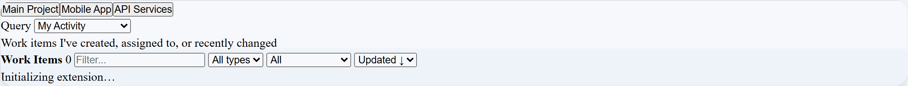

# Azure DevOps Integration for VS Code

**Streamline your development workflow** with Azure DevOps work items, time tracking, and Git integration directly in VS Code. Perfect for teams using Azure DevOps Services or DevOps Server (on-premises).

**Get Help:**

- Copy logs: `Azure DevOps Integration: Copy Logs to Clipboard`
- Open an issue on [GitHub](https://github.com/plures/azuredevops-integration-extension/issues)

## 🎬 See It In Action



**Watch the complete workflow:** Initialization → Work item queries → List and Kanban views with smooth transitions and native VS Code theming.

## 🚀 Key Features

### 📋 **Work Items Management**

- **Smart Queries**: Built-in filters (My Activity, Assigned to Me, Current Sprint, All Active, Recently Updated)
- **Custom WIQL**: Write your own queries with syntax validation and templates
- **Bulk Operations**: Multi-select work items for batch assign, state changes, tagging, and deletion
- **Advanced Filtering**: Save and share filter sets, export/import configurations

### ⏱️ **Time Tracking**

- **Smart Timer**: Auto-pause on inactivity, resume when you're back
- **Status Bar Integration**: Always visible timer with one-click controls
- **Automatic Updates**: Sync tracked time to work item hours
- **Time Reports**: View daily, weekly, monthly, and all-time tracking data

### 🔀 **Git Integration**

- **Branch Creation**: Generate branches from work items with customizable naming
- **Pull Request Flow**: Create PRs directly from your current branch
- **Smart Templates**: Configure branch naming patterns that fit your workflow

### 🔐 **Modern Authentication**

- **Microsoft Entra ID**: Secure OAuth 2.0 with automatic token refresh
- **Personal Access Tokens**: Traditional PAT support with secure storage
- **On-Premises Support**: Full compatibility with Azure DevOps Server
- **Connection Management**: Switch between multiple organizations seamlessly

### 🎨 **Rich Interface**

- **Dual Views**: Toggle between detailed list and visual Kanban board
- **Keyboard Navigation**: Vim-style shortcuts (r, v, /) and multi-select, plus an insert mode toggle to pause shortcuts while typing
- **Accessibility**: Full ARIA support and screen reader compatibility
- **Performance Dashboard**: Real-time metrics and optimization tips

### 🧠 **AI Integration**

- **Work Summaries**: Generate updates using Copilot prompts or OpenAI
- **Smart Drafts**: Per-work-item draft persistence for refining messages
- **Timer Integration**: Auto-select active work item for summaries

---

### 🛡️ Security & Trust

This extension handles your data with enterprise-grade security. For complete details on authentication, data access, and runtime security, see our [Security & Trust Notice](SECURITY.md).

## � Get Started in 3 Steps

### 1. 📥 **Install**

**From VS Code Marketplace:**

- Open Extensions view (`Ctrl+Shift+X`)
- Search "Azure DevOps Integration"
- Click Install

**Quick Install via Command Palette:**

- Press `Ctrl+P` (Cmd+P on macOS)
- Type: `ext install PluresLLC.azure-devops-integration-extension`

### 2. ⚙️ **Setup**

**Easy Setup Wizard (Recommended):**

1. Open Command Palette (`Ctrl+Shift+P`)
2. Run: `Azure DevOps Integration: Setup Wizard (Easy)`
3. **Paste any work item URL** from your Azure DevOps
4. Choose authentication method:
   - **Microsoft Entra ID** (OAuth) - Modern, secure, no tokens to manage
   - **Personal Access Token** - Traditional approach

The wizard auto-detects your organization, project, and server type!

**For On-Premises:** The extension fully supports Azure DevOps Server. Just use a work item URL from your server (e.g., `https://myserver/DefaultCollection/MyProject/_workitems/edit/123`)

### 3. 🎯 **Start Working**

- Click the **Azure DevOps** icon in the Activity Bar
- Browse work items with built-in queries or create custom WIQL
- Start timers, create branches, and manage work items directly in VS Code

---

## 🔐 Authentication Options

### 🌟 **Microsoft Entra ID (Recommended)**

**Perfect for Azure DevOps Services (cloud):**

- ✅ **No token management** - OAuth 2.0 handles everything
- ✅ **Auto-refresh** - Never worry about expired tokens
- ✅ **Status bar indicator** - See token status at a glance
- ✅ **One-click reconnect** - Easy reauthorization when needed

### � **Personal Access Token**

**Required for on-premises, available for cloud:**

**Minimum required scopes:**

- Work Items (Read & Write)
- User Profile (Read)
- Team (Read)
- Code (Read & Write) - for Git integration
- Build (Read) - for future features

**Generate at:** Azure DevOps → User Settings → Security → Personal Access Tokens

> **Note:** On-premises Azure DevOps Server only supports PAT authentication. The setup wizard automatically detects this and guides you accordingly.

## � Power User Features

### ⚡ **Bulk Operations**

Select multiple work items (Ctrl/Cmd+Click or checkboxes) for batch operations:

- **Bulk Assign** - Assign multiple items to any user
- **Bulk Move** - Change state for multiple items
- **Bulk Tag** - Add tags with smart merge (no duplicates)
- **Bulk Delete** - Soft delete with confirmation

### 🔍 **Advanced Filtering**

- **Query Builder** - Interactive WIQL with 5 pre-built templates
- **Saved Filters** - Save, manage, and share filter configurations
- **Export/Import** - JSON-based filter sharing
- **Live Validation** - Syntax checking with helpful error messages

### 📊 **Performance Dashboard**

- **Real-time Metrics** - Operation stats, cache hit rates, error tracking
- **Memory Monitoring** - Usage tracking and optimization tips
- **Cache Statistics** - View performance improvements and recommendations

### ⌨️ **Keyboard Shortcuts**

- `r` - Refresh • `v` - Toggle Kanban view • `/` - Focus search
- `Space` - Toggle selection • `Esc` - Clear selection or exit insert mode • `Ctrl+A` - Select all
- `i` / `I` - Enter insert mode to pause navigation shortcuts (type freely in summary/comments)
- **Full accessibility** with screen reader support

## ⌨️ Essential Commands

**Setup & Connection:**

- `Azure DevOps Integration: Setup Wizard (Easy)` - Guided setup with URL parsing
- `Azure DevOps Integration: Sign In with Microsoft Entra ID` - OAuth authentication
- `Azure DevOps Integration: Setup Connection` - Manual PAT setup

**Daily Workflow:**

- `Azure DevOps Integration: Show Work Items` - Open main view
- `Azure DevOps Integration: Start/Stop Timer` - Toggle time tracking
- `Azure DevOps Integration: Create Branch from Work Item` - Git integration
- `Azure DevOps Integration: Toggle Kanban View` - Switch view modes

**Advanced Features:**

- `Azure DevOps Integration: Query Builder` - Build custom WIQL queries
- `Azure DevOps Integration: Bulk Assign Work Items` - Multi-item operations
- `Azure DevOps Integration: Show Performance Dashboard` - View metrics
- `Azure DevOps Integration: Show Time Report` - Tracking reports

> 💡 **Pro Tip:** Press `Ctrl+Shift+P` and type "Azure DevOps" to see all available commands

## ⚙️ Configuration

**Key Settings (Optional):**

```jsonc
{
  // Time tracking
  "azureDevOpsIntegration.defaultElapsedLimitHours": 3.5,

  // AI integration
  "azureDevOpsIntegration.summaryProvider": "builtin", // or "openai"

  // Git templates
  "azureDevOpsIntegration.branchNameTemplate": "feature/{id}-{title}",

  // Performance
  "azureDevOpsIntegration.workItemsPerPage": 50,

  // Debugging
  "azureDevOpsIntegration.debugLogging": false,
}
```

> 🔒 **Security:** Tokens are stored securely in VS Code's secret store, never in settings files.

## 🔍 Troubleshooting

**Having issues?**

1. **Check Debug Logs:**
   - Enable: Set `azureDevOpsIntegration.debugLogging` to `true`
   - View: Command Palette → `Azure DevOps Integration: Open Logs`

2. **Common Solutions:**
   - **Empty work items**: Verify PAT scopes and organization/project settings
   - **Timer issues**: Confirm a work item is selected and no other timer is active
   - **Git integration**: Ensure PAT has Code (Read & Write) permissions

3. **Get Help:**
   - Copy logs: `Azure DevOps Integration: Copy Logs to Clipboard`
   - Open an issue on [GitHub](https://github.com/plures/azuredevops-integration-extension/issues)

---

## 📚 Documentation & Resources

- **[Marketplace Page](https://marketplace.visualstudio.com/items?itemName=PluresLLC.azure-devops-integration-extension)** - Install and reviews
- **[Security & Trust](SECURITY.md)** - Security practices and data handling
- **[Architecture Guide](docs/ARCHITECTURE.md)** - Technical details and CI testing
- **[Release Notes](CHANGELOG.md)** - Latest features and fixes
- **[GitHub Repository](https://github.com/plures/azuredevops-integration-extension)** - Source code and issues

## 🤝 Contributing

Contributions welcome! Please open an issue for substantial changes. Built with TypeScript, Svelte, and ESBuild following VS Code extension best practices.

**Quick Development:**

```bash
npm run build          # Build extension
npm run test           # Run tests
npm run test:integration # Integration tests (temporarily disabled)
```

## 📄 Legal

**License:** MIT License - see [LICENSE](./LICENSE.txt)  
**Attribution:** See [NOTICE](./NOTICE.md) for third-party licenses  
**Security:** Read our [Security & Trust Notice](SECURITY.md) for data handling details

---

**Enjoy streamlined Azure DevOps integration!** 🚀  
_Feedback and feature requests are always welcome._

- Architecture, security notes, and CI testing details: see [docs/ARCHITECTURE.md](./docs/ARCHITECTURE.md).
- What's new: see [CHANGELOG](./CHANGELOG.md) for the latest features and fixes.
