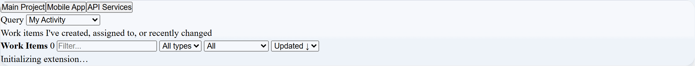

# Azure DevOps Integration for VS Code

Manage Azure DevOps work items, track time, and integrate Git workflows directly in VS Code — for both cloud and on-premises environments.



## Features

| Category | Highlights |
|----------|-----------|
| **Work Items** | Smart queries (My Activity, Assigned to Me, Current Sprint), custom WIQL, list & Kanban views |
| **Time Tracking** | Start/stop timers linked to work items, persists across restarts |
| **Git Integration** | Create branches from work items with configurable naming templates |
| **Authentication** | Microsoft Entra ID (OAuth 2.0 with auto-refresh) or Personal Access Tokens |
| **Multi-Connection** | Switch between organizations/projects seamlessly |

## Quick Start

1. **Install** — Search "Azure DevOps Integration" in the Extensions view (`Ctrl+Shift+X`) or run:
   ```
   ext install PluresLLC.azure-devops-integration-extension
   ```

2. **Setup** — Open Command Palette (`Ctrl+Shift+P`) → `Azure DevOps Integration: Setup Wizard (Easy)`. Paste any work item URL and the wizard auto-detects your organization, project, and server type.

3. **Use** — Click the Azure DevOps icon in the Activity Bar to browse work items, start timers, and create branches.

## Authentication

| Method | Best For | Details |
|--------|----------|---------|
| **Microsoft Entra ID** (recommended) | Azure DevOps Services (cloud) | OAuth 2.0 with automatic token refresh, no PAT to manage |
| **Personal Access Token** | On-premises or cloud | Requires scopes: Work Items (R/W), User Profile (R), Code (R/W) |

> Tokens are stored in VS Code's secret store, never in settings files.

## Commands

| Command | Description |
|---------|-------------|
| `Setup Wizard (Easy)` | Guided setup with URL parsing |
| `Sign In with Microsoft Entra ID` | OAuth authentication |
| `Show Work Items` | Open main panel |
| `Start/Stop Timer` | Toggle time tracking |
| `Create Branch from Work Item` | Git branch creation |
| `Toggle Kanban View` | Switch list/Kanban |
| `Refresh Work Items` | Refresh data |

> Press `Ctrl+Shift+P` and type "Azure DevOps" to see all commands.

## Configuration

```jsonc
{
  "azureDevOpsIntegration.branchNameTemplate": "feature/{id}-{title}",
  "azureDevOpsIntegration.debugLogging": false
}
```

## Troubleshooting

1. Enable debug logs: set `azureDevOpsIntegration.debugLogging` to `true`
2. View logs: Command Palette → `Azure DevOps Integration: Open Logs`
3. Copy logs: `Azure DevOps Integration: Copy Logs to Clipboard`
4. [Open an issue](https://github.com/plures/azuredevops-integration-extension/issues) with the copied logs

## Architecture

Built with a reactive, event-driven architecture:

- **[Praxis](https://github.com/plures/praxis)** — Type-safe logic engine for state management
- **Svelte 5** — Reactive UI with runes
- **TypeScript** — Full compile-time safety
- **esbuild** — Fast bundling

See [docs/ARCHITECTURE.md](docs/ARCHITECTURE.md) for technical details.

## Contributing

```bash
npm run build    # Compile and validate
npm run test     # Run unit tests
```

Use [conventional commits](https://www.conventionalcommits.org/) (`feat:`, `fix:`, etc.). Releases are automated via GitHub Actions on merge to main. See [docs/RELEASE_PROCESS.md](docs/RELEASE_PROCESS.md).

## Security

See [SECURITY.md](SECURITY.md) for authentication details, data handling, and runtime security practices.

## License

MIT — see [LICENSE.txt](LICENSE.txt) · Third-party notices in [NOTICE.md](NOTICE.md)
