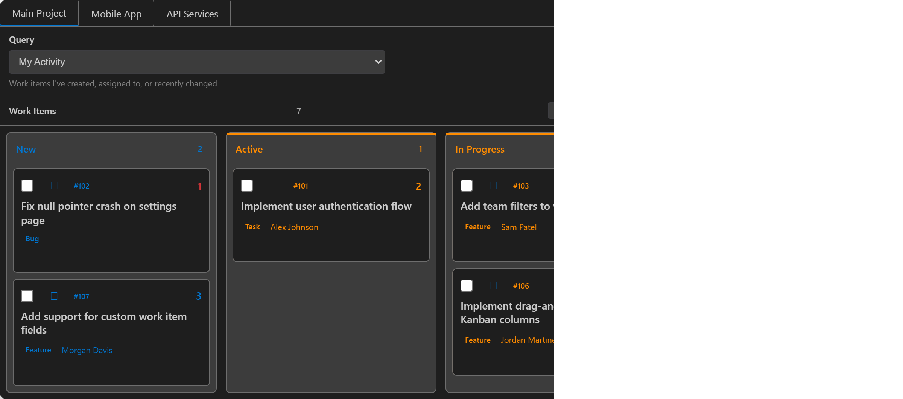

# Azure DevOps Integration for VS Code

Integrate Azure DevOps work items, time tracking, branching, and pull requests directly inside VS Code.

## 🚀 Highlights

- Unified work items view with built-in filters (My Activity, Assigned to Me, Following, Mentioned, Current Sprint, All Active, Recently Updated) or custom WIQL
- Team-aware Current Sprint: respects your selected team's current iteration
- One‑click work item creation
- Lightweight time tracking with inactivity auto‑pause
- Status bar timer with start/stop and pause/resume commands
- Branch creation from a selected work item (optional auto‑start timer)
- Pull request creation & quick access to your active PRs
- Secure PAT storage (secret store) + automatic migration from legacy keys
- Verbose diagnostic logging (opt‑in) for easier troubleshooting
- Webview filters (Sprint, Type, Assigned To) and a Kanban toggle
- Per‑work‑item draft persistence in the editor (your notes stick to each item locally)
- Smart stop flow: proposes Completed/Remaining updates and can post an AI-generated summary comment (Copilot prompt or OpenAI response)
- Reliable queries across process templates with runtime compatibility fallback
- Tunable API rate limiting (sustained rate and burst) to play nicely with Azure DevOps throttling
- Optional MCP server for automation and agent/tool integrations (JSON‑RPC)
- Consistent Start/Stop and Edit actions across list and Kanban
- Preserved scroll positions (list vertical, Kanban horizontal) for smoother UX
- Keyboard Kanban navigation (Ctrl/Cmd + ←/→) with live toast feedback on move
- Accessible toast notifications (aria-live polite) for move success/errors
- Codicon-based iconography (replaces legacy emojis) for actions and status

## 📥 Installation

From VS Code: Extensions view → search "Azure DevOps Integration" → Install.

Command palette quick install:

1. Press Ctrl+P (Cmd+P on macOS)
2. Type: ext install PluresLLC.azure-devops-integration-extension
3. Press Enter

Marketplace page: [Azure DevOps Integration – VS Code Marketplace](https://marketplace.visualstudio.com/items?itemName=PluresLLC.azure-devops-integration-extension)

## 🔐 Create a Personal Access Token

Required scopes (minimum recommended):

- Work Items (Read & Write)
- User Profile (Read)
- Team (Read)
- Code (Read & Write) – optional, for PRs & repos
- Build (Read) – optional, for planned build status features

Generate at: Azure DevOps → User Settings → Security → Personal Access Tokens.

## ⚙️ Setup

Run: Azure DevOps Integration: Setup Connection
Provide Organization (short name), Project, and PAT. The extension stores the PAT securely. If settings already exist it silently initializes on startup.

Optional: set a Team for iteration-aware queries

- Use the command: Azure DevOps Integration: Select Team to set a team context. When set, the "Current Sprint" query resolves using that team's current iteration. You can clear or change this later by running the command again.

Where to find it in VS Code

- The extension adds an Activity Bar container named "Azure DevOps" with a "Work Items" view. Open it to browse, filter (Sprint, Type, Assigned To), switch Kanban/List, and act on items.

## 🕒 Time Tracking

- Start/Stop timer from the command palette or by picking a work item
- Auto‑pause after configurable inactivity timeout
- Auto‑resume on activity (configurable)
- View summarized time via Show Time Report (Today, Week, Month, All Time)
- Elapsed cap: if a timer was left running, an optional cap (default 3.5 hours) is applied on stop to prevent over‑reporting
- On Stop, the extension proposes Completed/Remaining updates and can generate a concise AI summary (Copilot prompt or OpenAI response) for the work item

## 🧠 AI Summaries

- **Copilot prompts by default:** Stopping a timer or using the summary panel copies a Copilot-ready prompt to your clipboard. Paste it into GitHub Copilot Chat (or any LLM) to produce a summary.
- **OpenAI integration (optional):** Run `Azure DevOps Integration: Set OpenAI API Key` to store an API key securely. Then set `azureDevOpsIntegration.summaryProvider` to `openai` (and optionally choose an `openAiModel`). The extension will call OpenAI directly and copy the generated summary to your clipboard.
- **Draft-aware composer:** The summary panel keeps per-work-item drafts in localStorage so you can refine the message before applying updates or generating AI output.
- **Timer-friendly:** When a timer is active, the panel auto-selects that work item and pre-fills a suggested note you can edit before sending to Copilot or OpenAI.

## ⌨️ Core Commands

| Command ID                                | Palette Title                                          |
| ----------------------------------------- | ------------------------------------------------------ |
| azureDevOpsInt.setup                      | Azure DevOps Integration: Setup Connection             |
| azureDevOpsInt.showWorkItems              | Azure DevOps Integration: Show Work Items              |
| azureDevOpsInt.createWorkItem             | Azure DevOps Integration: Create Work Item             |
| azureDevOpsInt.refreshWorkItems           | Azure DevOps Integration: Refresh Work Items           |
| azureDevOpsInt.startTimer                 | Azure DevOps Integration: Start/Stop Timer             |
| azureDevOpsInt.pauseTimer                 | Azure DevOps Integration: Pause Timer                  |
| azureDevOpsInt.resumeTimer                | Azure DevOps Integration: Resume Timer                 |
| azureDevOpsInt.stopTimer                  | Azure DevOps Integration: Stop Timer                   |
| azureDevOpsInt.showTimeReport             | Azure DevOps Integration: Show Time Report             |
| azureDevOpsInt.createBranch               | Azure DevOps Integration: Create Branch from Work Item |
| azureDevOpsInt.createPullRequest          | Azure DevOps Integration: Create Pull Request          |
| azureDevOpsInt.showPullRequests           | Azure DevOps Integration: Show My Pull Requests        |
| azureDevOpsInt.toggleKanbanView           | Azure DevOps Integration: Toggle Kanban View           |
| azureDevOpsInt.selectTeam                 | Azure DevOps Integration: Select Team                  |
| azureDevOpsInt.resetPreferredRepositories | Azure DevOps Integration: Reset Preferred Repositories |
| azureDevOpsInt.setOpenAIApiKey            | Azure DevOps Integration: Set OpenAI API Key           |

More helpful commands (selection):

- Set Default Timer Elapsed Cap — `azureDevOpsInt.setDefaultElapsedLimit`

## 🔧 Configuration (Settings)

Namespace: `azureDevOpsIntegration`

```jsonc
{
  "azureDevOpsIntegration.organization": "myorg",
  "azureDevOpsIntegration.project": "myproject",
  "azureDevOpsIntegration.debugLogging": false,

  // Work item list behavior
  "azureDevOpsIntegration.defaultWorkItemType": "Task",
  "azureDevOpsIntegration.workItemQuery": "<WIQL query>",
  "azureDevOpsIntegration.showCompletedWorkItems": false,
  "azureDevOpsIntegration.workItemsPerPage": 50,
  "azureDevOpsIntegration.enableAutoRefresh": true,
  "azureDevOpsIntegration.refreshIntervalMinutes": 5,

  // Time tracking
  "azureDevOpsIntegration.enableTimeTracking": true,
  "azureDevOpsIntegration.defaultElapsedLimitHours": 3.5,

  // AI summaries
  "azureDevOpsIntegration.summaryProvider": "builtin", // or "openai"
  "azureDevOpsIntegration.openAiModel": "gpt-4o-mini",

  // Git integration
  "azureDevOpsIntegration.enableBranchCreation": true,
  "azureDevOpsIntegration.enablePullRequestCreation": true,
  "azureDevOpsIntegration.branchNameTemplate": "feature/{id}-{title}",

  // Azure DevOps API rate limiting
  "azureDevOpsIntegration.apiRatePerSecond": 2,
  "azureDevOpsIntegration.apiBurst": 5,
}
```

The Personal Access Token is stored via the VS Code secret storage (not in settings.json).

## 🔍 Logging & Diagnostics

Enable setting: azureDevOpsIntegration.debugLogging. An output channel "Azure DevOps Integration" appears with verbose lifecycle, webview message, and refresh diagnostics.

Quick ways to share logs

- Command palette → "Azure DevOps: Open Logs" to open the extension's Output channel. If verbose logging is off, you'll be prompted to enable it. Reproduce the issue, then copy the output and attach it to your issue.
- Command palette → "Azure DevOps: Copy Logs to Clipboard" to copy the collected logs (including webview forwarding and context header) in one click.
- Command palette → "Azure DevOps: Open Logs Folder (VS Code)" to open the VS Code logs directory. Zip the folder for the current window (it contains extension host logs like exthost.log) and attach it to your issue if requested.
- Optional: Developer Tools (Help → Toggle Developer Tools) can surface webview console errors. The extension forwards many webview console messages into the Output channel when logging is enabled.

Rate limiting controls

- You can tune Azure DevOps REST throughput via `azureDevOpsIntegration.apiRatePerSecond` and `azureDevOpsIntegration.apiBurst` if your org has strict throttling or you're working with very large queries.

## 🔄 Migration & Backward Compatibility

- Legacy config keys under azureDevOps.\* are auto‑migrated if the new values are empty.
- Legacy secret key azureDevOps.pat is migrated to azureDevOpsInt.pat.
- Class alias: AzureDevOpsClient (deprecated) still exported pointing to AzureDevOpsIntClient.

## ❓ Troubleshooting

| Issue                | Hint                                                                               |
| -------------------- | ---------------------------------------------------------------------------------- |
| Empty work item list | Verify organization/project & WIQL query (default: My Activity). Check PAT scopes. |
| Timer not starting   | Ensure a work item is selected; confirm no existing active timer.                  |
| PR creation fails    | Confirm Code (Read & Write) scope on PAT and repository presence.                  |

### Pull requests and preferred repositories

- The first time you create a PR, you'll be prompted to pick one or more repositories. These are saved as `azureDevOpsIntegration.preferredRepositoryIds`.
- To change or clear your choices, run: Azure DevOps Integration: Reset Preferred Repositories.
- The "Show My Pull Requests" command searches across repositories and filters to your identity.

## 📦 Development

Scripts:

- build:all – build the extension bundle
- screenshots:setup – one-time install of Playwright browser (Chromium)
- screenshots:capture – generate PNGs from the committed webview using fixture data
- screenshots:build – build extension then capture screenshots
- screenshots:watch – watch `media/webview/**` and recapture on change

Launch configs (/.vscode) let you run the extension with live reload (watch tasks).

Optional: MCP server for automation

- This repo includes a minimal Model Context Protocol (MCP) server that exposes a lean set of Azure DevOps Work Item operations over JSON-RPC. See `mcp-server/README.md` if you want to script or integrate with agent toolchains.

## 📘 Queries and compatibility

- The work items view includes a query filter dropdown with options for My Activity (default), Assigned to Me, Following, Mentioned, Current Sprint, All Active, and Recently Updated. Each connection remembers your last choice.
- Process‑agnostic active filter: when supported by your org, the extension uses `[System.StateCategory] <> 'Completed'` and excludes items in `'Removed'` for default queries like "My Activity", "Assigned to Me", "All Active", and "Current Sprint".
- Runtime fallback: some organizations or older processes reject `System.StateCategory` in WIQL. If that happens, the extension automatically falls back to a legacy filter equivalent to `NOT IN ('Closed','Done','Resolved','Removed')` and retries the query.
- Recently Updated window: the "Recently Updated" query uses a 14‑day window (`[System.ChangedDate] >= @Today - 14`).

## 🤝 Contributing

Pull requests welcome. Please open an issue first for substantial changes. Add tests where practical (client querying, timer edge cases) and keep logging minimal outside debug mode.

## 📄 License

MIT License – see [LICENSE](./LICENSE.txt)

---

Enjoy the extension! Feedback & feature requests are appreciated.

## 🖼️ Screenshots

Below are preview-friendly screenshots captured at a consistent size and tightly cropped to the content so they render cleanly in VS Code preview and on the Marketplace.

### Work Items – List View (v1.7.0)


### Work Items – Kanban View (v1.7.0)



<!-- Timer-specific screenshot removed; the timer is visible inline in the list/kanban views when active. -->

## More

- Attribution and license details: see [NOTICE](./NOTICE.md) and [LICENSE](./LICENSE.txt).
- Architecture, security notes, and CI testing details: see [docs/ARCHITECTURE.md](./docs/ARCHITECTURE.md).
- What's new: see [CHANGELOG](./CHANGELOG.md) for the latest features and fixes.
