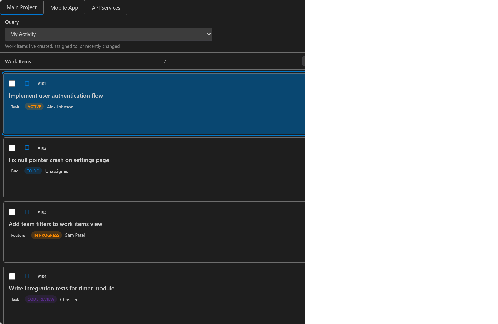

# Azure DevOps Integration for VS Code

Integrate Azure DevOps work items, time tracking, branching, and pull requests directly inside VS Code.

## 🚀 Key Features

### Core Functionality

- **Work Items Management**: Unified view with built-in filters (My Activity, Assigned to Me, Current Sprint, All Active, Recently Updated) and custom WIQL support
- **Time Tracking**: Lightweight timer with inactivity auto-pause, status bar integration, and automatic work item updates
- **Git Integration**: Create branches and pull requests directly from work items with customizable naming templates
- **Smart Setup**: Easy setup wizard that parses work item URLs and guides you through configuration
- **AI-Powered Summaries**: Generate work summaries using Copilot prompts or OpenAI integration
- **Multiple Views**: Switch between list and Kanban views with preserved scroll positions and keyboard navigation
- **Secure Storage**: PAT tokens stored securely in VS Code's secret store with automatic migration

### 🆕 Advanced Features (v1.8.2+)

- **🎯 Bulk Operations**: Multi-select work items and apply changes in batch
  - Select with Ctrl/Cmd+Click or checkboxes
  - Bulk assign, move states, add tags, or delete
  - Real-time progress tracking with error handling
  - Animated toolbar appears when items selected

- **🔍 Filter & Query Management**: Complete filtering system
  - Interactive Query Builder with 5 pre-built templates
  - Save and manage named filter sets
  - Export/import filter configurations as JSON
  - WIQL syntax help and validation

- **📊 Performance Monitoring**: Real-time observability
  - Performance Dashboard with operation metrics
  - Memory usage tracking and optimization tips
  - Cache statistics and hit rates
  - Manual garbage collection

- **🚀 Performance Optimization**: Intelligent caching system with 60-80% faster API responses
- **⌨️ Keyboard Navigation**: Vim-style shortcuts (r, v, /), multi-select with Space/Esc/Ctrl+A
- **♿ Accessibility**: Full ARIA support, screen reader compatibility, keyboard-only operation
- **🔧 Enhanced Error Handling**: Detailed, actionable error messages with troubleshooting steps

## 📥 Installation

From VS Code: Extensions view → search "Azure DevOps Integration" → Install.

Command palette quick install:

1. Press Ctrl+P (Cmd+P on macOS)
2. Type: ext install PluresLLC.azure-devops-integration-extension
3. Press Enter

Marketplace page: [Azure DevOps Integration – VS Code Marketplace](https://marketplace.visualstudio.com/items?itemName=PluresLLC.azure-devops-integration-extension)

## 🔐 Authentication

### Microsoft Entra ID (Recommended) 🆕

Sign in with your Microsoft account - no token creation needed:
- **OAuth 2.0 Authentication**: Modern, secure authentication flow
- **Automatic Token Refresh**: Tokens refresh automatically in the background
- **Enterprise Compatible**: Works with your organization's security policies
- **Device Code Flow**: Simple browser-based sign-in process
- **No Manual Setup**: No need to create or manage Personal Access Tokens

### Personal Access Token (Traditional)

If you prefer or need PAT authentication:

Required scopes (minimum recommended):
- Work Items (Read & Write)
- User Profile (Read)
- Team (Read)
- Code (Read & Write) – optional, for PRs & repos
- Build (Read) – optional, for planned build status features

Generate at: Azure DevOps → User Settings → Security → Personal Access Tokens.

## ⚙️ Quick Setup

### Easy Setup Wizard (Recommended)

1. Open the Command Palette (`Ctrl+Shift+P` / `Cmd+Shift+P`)
2. Run: `Azure DevOps Integration: Setup Wizard (Easy)`
3. Paste a work item URL from your Azure DevOps organization
4. The wizard will auto-detect your organization and project
5. **Choose Authentication Method**: Microsoft Entra ID (recommended) or Personal Access Token
6. **For Entra ID**: Follow the device code flow to sign in with your Microsoft account
7. **For PAT**: Follow the guided steps to create a Personal Access Token
8. Test your connection and you're ready to go!

### Manual Setup

1. Run: `Azure DevOps Integration: Setup Connection`
2. Provide your Organization (short name), Project, and PAT
3. The extension stores the PAT securely in VS Code's secret store

### Optional: Team Configuration

- Use `Azure DevOps Integration: Select Team` to set a team context
- When set, the "Current Sprint" query uses that team's current iteration
- You can change or clear this anytime by running the command again

### Accessing the Extension

- Look for the "Azure DevOps" icon in the Activity Bar
- Click to open the "Work Items" view
- Browse, filter, and manage your work items with list or Kanban views

## 🕒 Time Tracking

- **Start/Stop Timer**: Click the timer button on any work item or use the command palette
- **Smart Pause**: Automatically pauses after inactivity (configurable timeout)
- **Auto-Resume**: Resumes when you become active again
- **Time Reports**: View tracked time across different periods (Today, Week, Month, All Time)
- **Automatic Updates**: When stopping a timer, automatically updates work item's Completed/Remaining hours
- **AI Summaries**: Generate work summaries using Copilot prompts or OpenAI integration

## 🧠 AI-Powered Work Summaries

- **Copilot Integration**: Generate Copilot-ready prompts for work summaries
- **OpenAI Support**: Direct integration with OpenAI for automatic summary generation
- **Smart Drafts**: Per-work-item draft persistence for refining your messages
- **Timer Integration**: Auto-selects active work item when generating summaries

## 🚀 Advanced Features (v1.8.2+)

### Bulk Operations

- **Multi-Select UI**: Click checkboxes or Ctrl/Cmd+Click to select multiple work items
- **Bulk Assign**: Assign multiple work items to any user at once
- **Bulk Move**: Change state for multiple items simultaneously
- **Bulk Add Tags**: Add tags to multiple items with smart merge (no duplicates)
- **Bulk Delete**: Soft delete with double-confirmation for safety
- **Visual Feedback**: Animated toolbar, progress tracking, and selection count

### Filter & Query Management

- **Query Builder**: Interactive WIQL construction with 5 pre-built templates
  - My Work Items, Recently Changed, Active Bugs, Current Sprint, Unassigned Items
  - Live syntax validation with helpful error messages
  - Comprehensive WIQL help reference
- **Saved Filters**: Save, load, delete, and manage named filter sets
- **Export/Import**: Share filter configurations as JSON files
- **Quick Actions**: Clear all filters (`/`), focus search, manage saved queries

### Performance & Monitoring

- **Performance Dashboard**: Comprehensive metrics and health analytics
  - Operation statistics (duration, error rate, cache hit rate)
  - Memory usage tracking (current, peak, RSS)
  - Cache statistics and optimization recommendations
- **Clear Performance Data**: Reset baseline metrics
- **Force Garbage Collection**: Manual memory cleanup (if --expose-gc enabled)
- **Intelligent Caching**: 60-80% faster API responses with automatic memory management
- **Smart Optimization**: Automatic garbage collection and performance recommendations

### Keyboard Shortcuts

- **Navigation**: `r` to refresh, `v` to toggle Kanban view
- **Search**: `/` to focus search box
- **Selection**: `Space` to toggle selection, `Esc` to clear, `Ctrl+A` to select all
- **Multi-Select**: `Ctrl/Cmd+Click` on work items to build selection
- **Accessibility**: Full keyboard-only operation with screen reader support

## ⌨️ Essential Commands

| Command                                                  | Description                             |
| -------------------------------------------------------- | --------------------------------------- |
| `Azure DevOps Integration: Setup Wizard (Easy)`          | Guided setup with work item URL parsing |
| `Azure DevOps Integration: Setup Connection`             | Manual connection setup                 |
| `Azure DevOps Integration: Sign In with Microsoft Entra ID` 🆕 | Sign in using OAuth 2.0 device code flow |
| `Azure DevOps Integration: Sign Out from Entra ID` 🆕     | Sign out and clear Entra ID tokens     |
| `Azure DevOps Integration: Convert Connection to Entra ID` 🆕 | Switch from PAT to Entra ID authentication |
| `Azure DevOps Integration: Show Work Items`              | Open the work items view                |
| `Azure DevOps Integration: Start/Stop Timer`             | Toggle timer for selected work item     |
| `Azure DevOps Integration: Show Time Report`             | View time tracking reports              |
| `Azure DevOps Integration: Create Work Item`             | Create a new work item                  |
| `Azure DevOps Integration: Create Branch from Work Item` | Create Git branch from work item        |
| `Azure DevOps Integration: Create Pull Request`          | Create PR from current branch           |
| `Azure DevOps Integration: Toggle Kanban View`           | Switch between list and Kanban views    |
| `Azure DevOps Integration: Select Team`                  | Set team context for sprint queries     |
| `Azure DevOps Integration: Set OpenAI API Key`           | Configure OpenAI integration            |

### 🆕 Advanced Commands (v1.8.2+)

| Command                                                | Description                                     | Keybinding |
| ------------------------------------------------------ | ----------------------------------------------- | ---------- |
| **Bulk Operations**                                    |                                                 |            |
| `Azure DevOps Integration: Bulk Assign Work Items`     | Assign selected items to any user               |            |
| `Azure DevOps Integration: Bulk Move Work Items`       | Change state for selected items                 |            |
| `Azure DevOps Integration: Bulk Add Tags`              | Add tags to selected items (smart merge)        |            |
| `Azure DevOps Integration: Bulk Delete Work Items`     | Soft delete selected items (double-confirmation)|            |
| **Filter & Query Management**                          |                                                 |            |
| `Azure DevOps Integration: Query Builder`              | Build WIQL queries with templates & validation  |            |
| `Azure DevOps Integration: Manage Saved Filters`       | Save, load, delete named filter sets            |            |
| `Azure DevOps Integration: Export Filters to File`     | Export current filters to JSON                  |            |
| `Azure DevOps Integration: Import Filters from File`   | Import filters from JSON                        |            |
| `Azure DevOps Integration: Clear All Filters`          | Reset all active filters                        |            |
| `Azure DevOps Integration: Focus Search Box`           | Jump to search input                            | `/`        |
| **Performance Monitoring**                             |                                                 |            |
| `Azure DevOps Integration: Show Performance Dashboard` | View metrics, memory, cache stats, & tips       |            |
| `Azure DevOps Integration: Clear Performance Data`     | Reset performance metrics                       |            |
| `Azure DevOps Integration: Force Garbage Collection`   | Manually trigger GC (if --expose-gc enabled)    |            |

## 🔧 Key Settings

The most important settings you might want to configure:

```jsonc
{
  // Time tracking
  "azureDevOpsIntegration.defaultElapsedLimitHours": 3.5,
  "azureDevOpsIntegration.enableTimeTracking": true,

  // AI summaries
  "azureDevOpsIntegration.summaryProvider": "builtin", // or "openai"
  "azureDevOpsIntegration.openAiModel": "gpt-4o-mini",

  // Git integration
  "azureDevOpsIntegration.branchNameTemplate": "feature/{id}-{title}",
  "azureDevOpsIntegration.enableBranchCreation": true,

  // Work items
  "azureDevOpsIntegration.workItemsPerPage": 50,
  "azureDevOpsIntegration.enableAutoRefresh": true,

  // Debugging
  "azureDevOpsIntegration.debugLogging": false,
}
```

> **Note**: Personal Access Tokens are stored securely in VS Code's secret store, not in settings.json.

## 🔍 Troubleshooting

If you encounter issues:

1. **Enable Debug Logging**: Set `azureDevOpsIntegration.debugLogging` to `true` in settings
2. **View Logs**: Run `Azure DevOps Integration: Open Logs` to see detailed diagnostics
3. **Copy Logs**: Use `Azure DevOps Integration: Copy Logs to Clipboard` to share logs for support

### Common Issues

| Issue                | Solution                                                        |
| -------------------- | --------------------------------------------------------------- |
| Empty work item list | Verify organization/project settings and PAT scopes             |
| Timer not starting   | Ensure a work item is selected and no timer is already active   |
| PR creation fails    | Confirm PAT has Code (Read & Write) scope and repository exists |

## 📦 Development

This extension is built with modern tooling and follows VS Code extension best practices:

- **TypeScript** with strict type checking
- **Svelte** for the webview UI components
- **ESBuild** for fast compilation
- **Comprehensive testing** with unit and integration tests

### Development Scripts

```bash
npm run build          # Build the extension
npm run test           # Run unit tests
npm run test:integration # Run integration tests
npm run screenshots:capture # Generate documentation screenshots
```

### MCP Server

The repository includes a Model Context Protocol (MCP) server for automation and agent integrations. See `mcp-server/README.md` for details.

## 🤝 Contributing

Pull requests welcome. Please open an issue first for substantial changes. Add tests where practical (client querying, timer edge cases) and keep logging minimal outside debug mode.

## 📄 License

MIT License – see [LICENSE](./LICENSE.txt)

---

Enjoy the extension! Feedback & feature requests are appreciated.

## 🖼️ Screenshots

Below are preview-friendly screenshots captured at a consistent size and tightly cropped to the content so they render cleanly in VS Code preview and on the Marketplace.

### Work Items – List View (v1.7.0)



### Work Items – Kanban View (v1.7.0)


<!-- Timer-specific screenshot removed; the timer is visible inline in the list/kanban views when active. -->

## More

- Attribution and license details: see [NOTICE](./NOTICE.md) and [LICENSE](./LICENSE.txt).
- Architecture, security notes, and CI testing details: see [docs/ARCHITECTURE.md](./docs/ARCHITECTURE.md).
- What's new: see [CHANGELOG](./CHANGELOG.md) for the latest features and fixes.
