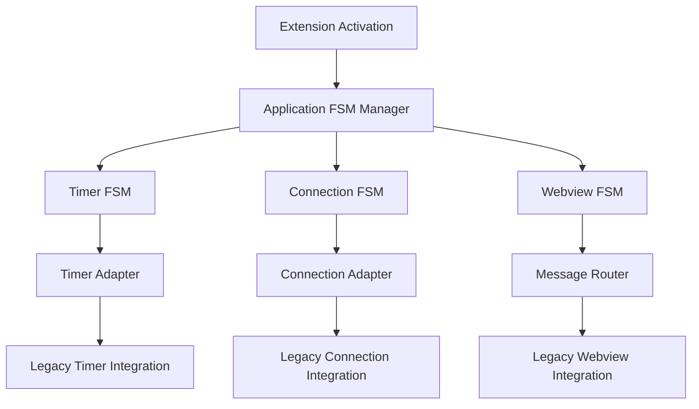
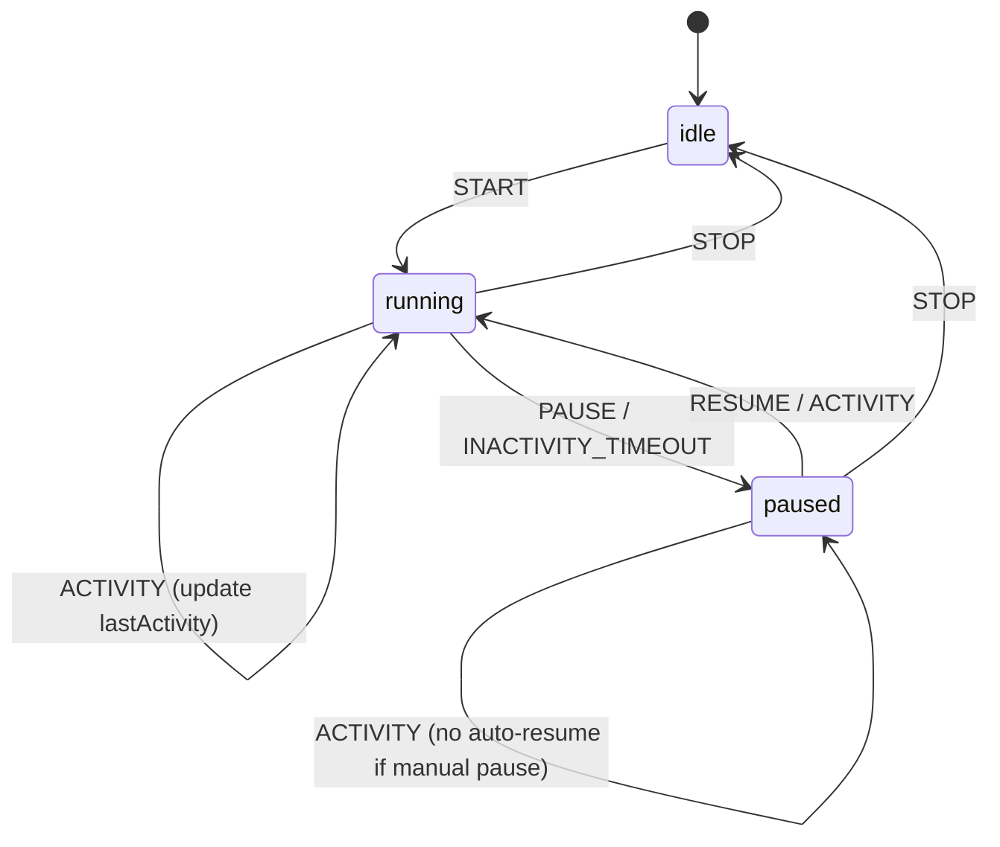
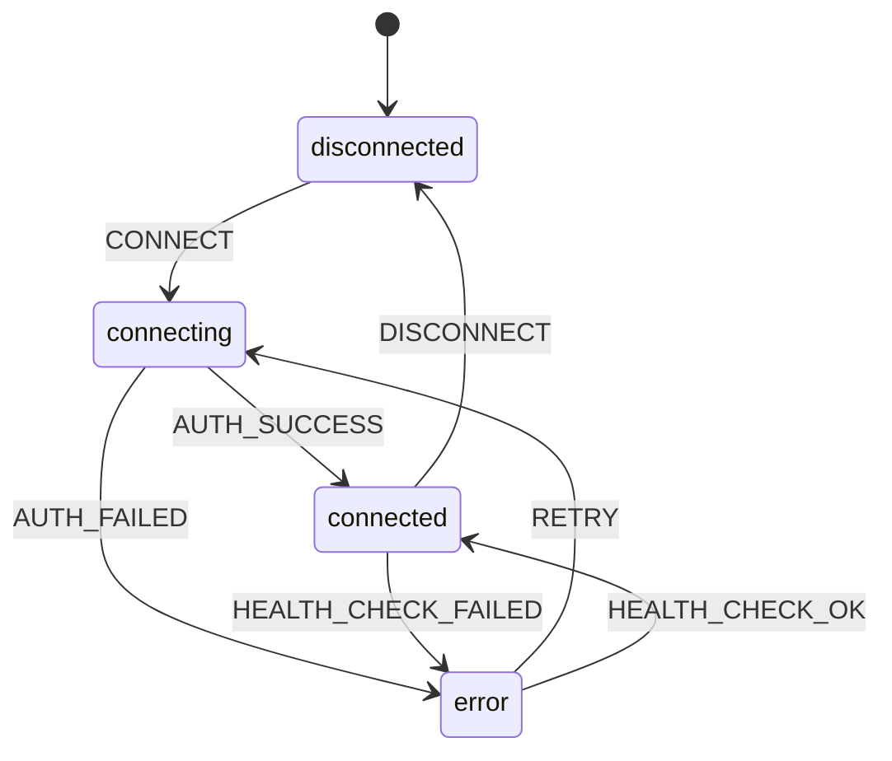
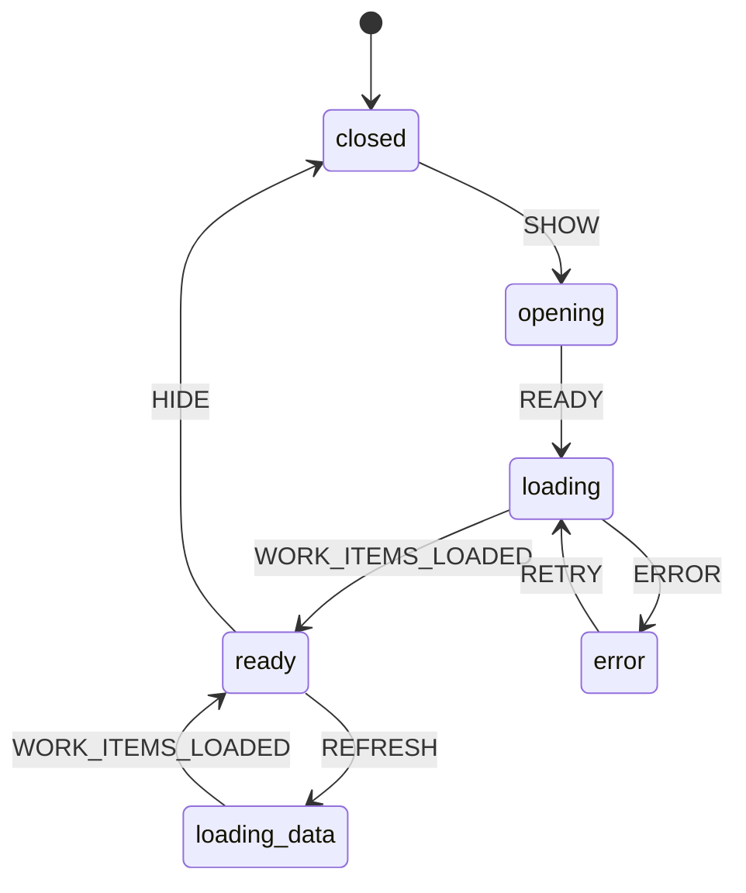

# 🔍 FSM Visualization Guide - XState Integration

This guide shows you how to visualize and debug the Azure DevOps Integration extension's Finite State Machine (FSM) architecture using XState tools.

## 🎯 Quick Start

### 1. Enable FSM Visualization

```json
// settings.json
{
  "azureDevOpsIntegration.experimental.useFSM": true,
  "azureDevOpsIntegration.experimental.enableFSMInspector": true,
  "azureDevOpsIntegration.experimental.fsmComponents": ["timer", "connection", "webview"]
}
```

### 2. Start the Inspector

- **Command Palette**: `Azure DevOps Int (Debug): Start Application FSM Inspector`
- **Environment**: Set `ENABLE_FSM_INSPECTOR=true` in your dev environment
- **URL**: Visit https://stately.ai/inspect to see live state machines

---

## 🏗️ FSM Architecture Overview



---

## ⏱️ Timer State Machine

### States & Transitions



### Context Data

```typescript
{
  workItemId?: number;
  workItemTitle?: string;
  startTime?: number;
  elapsedSeconds: number;
  isPaused: boolean;
  lastActivity: number;
  inactivityTimeoutSec: 300; // 5 minutes default
  defaultElapsedLimitHours: 3.5;
  pomodoroEnabled: boolean;
  pomodoroCount: number;
}
```

### Key Events

- **START**: `{ workItemId, workItemTitle }`
- **PAUSE**: `{ manual?: boolean }`
- **RESUME**: `{ fromActivity?: boolean }`
- **TICK**: Updates elapsed time every second
- **ACTIVITY**: User activity detected
- **STOP**: Saves time entry and resets

---

## 🔗 Connection State Machine (Planned)

### States & Transitions



### Context Data

```typescript
{
  connectionId?: string;
  client?: AzureDevOpsIntClient;
  provider?: WorkItemsProvider;
  lastError?: string;
  retryCount: number;
  maxRetries: 3;
  isHealthy: boolean;
}
```

---

## 🖥️ Webview State Machine (Planned)

### States & Transitions



### Context Data

```typescript
{
  panel?: vscode.WebviewPanel;
  workItems: any[];
  selectedItems: number[];
  isLoading: boolean;
  error?: string;
  currentView: 'list' | 'kanban';
  lastRefresh?: number;
}
```

---

## 🛠️ Development Tools

### XState Inspector Integration

The extension integrates with Stately's XState Inspector for real-time visualization:

```typescript
// Automatic setup when FSM is enabled
const inspector = createBrowserInspector({
  url: 'https://stately.ai/registry/editor/...',
});

// Actors automatically connect to inspector
inspector.actor(timerActor);
```

### Debug Commands

| Command                                       | Description              |
| --------------------------------------------- | ------------------------ |
| `azureDevOpsInt.showApplicationFSMStatus`     | Show current FSM status  |
| `azureDevOpsInt.startApplicationFSMInspector` | Launch XState Inspector  |
| `azureDevOpsInt.resetApplicationFSM`          | Reset all state machines |
| `azureDevOpsInt.validateTimerSync`            | Check FSM vs Legacy sync |

### Configuration Options

```json
{
  // Enable FSM features
  "azureDevOpsIntegration.experimental.useFSM": true,

  // Select components to use FSM for
  "azureDevOpsIntegration.experimental.fsmComponents": [
    "timer", // Timer operations
    "connection", // Connection management
    "webview", // UI state management
    "messaging" // Message routing
  ],

  // Enable visual inspector
  "azureDevOpsIntegration.experimental.enableFSMInspector": true
}
```

---

## 📊 Real-Time Visualization

### 1. Stately Inspector (Recommended)

Visit **https://stately.ai/inspect** and you'll see:

- **Live state transitions** as they happen
- **Context data updates** in real-time
- **Event timeline** with full history
- **Interactive debugging** - send events manually
- **Performance metrics** and transition timing

### 2. VS Code Output Channel

```
[AzureDevOpsInt][FSM] Timer: idle → running (START: workItemId=1234)
[AzureDevOpsInt][FSM] Timer context: { workItemId: 1234, elapsedSeconds: 0, isPaused: false }
[AzureDevOpsInt][FSM] Timer: running → paused (INACTIVITY_TIMEOUT)
[AzureDevOpsInt][FSM] Timer: paused → running (ACTIVITY)
```

### 3. Command Palette Status

```bash
# Show current state
> Azure DevOps Int (Debug): Show Application FSM Status

# Output:
✅ FSM Manager: Started
🔄 Timer State: running
📊 Context: { workItemId: 1234, elapsedSeconds: 157 }
🔍 Inspector: Active at https://stately.ai/inspect
```

---

## 🧪 Testing FSM Behavior

### Manual Event Triggers

Use the inspector or debug commands to trigger events:

```javascript
// Via Inspector Console
timerActor.send({ type: 'START', workItemId: 1234, workItemTitle: 'Test Item' });
timerActor.send({ type: 'PAUSE' });
timerActor.send({ type: 'ACTIVITY' }); // Should auto-resume
```

### Validation Commands

```bash
# Check if FSM and legacy are in sync
> Azure DevOps Int (Debug): Validate Timer Synchronization

# Reset FSM to clean state
> Azure DevOps Int (Debug): Reset Application FSM
```

---

## 🚀 Migration Path

### Current Implementation Status

- ✅ **Timer FSM**: Complete with XState v5
- ✅ **FSM Inspector**: Integrated with Stately
- ✅ **Adapter Pattern**: Legacy compatibility maintained
- 🔄 **Connection FSM**: Architecture ready, implementation in progress
- 🔄 **Webview FSM**: Architecture ready, implementation planned

### Feature Flags

The FSM architecture uses feature flags for safe rollout:

```typescript
// Gradually enable FSM components
const useFSM = config.get<boolean>('experimental.useFSM', false);
const components = config.get<string[]>('experimental.fsmComponents', []);

if (useFSM && components.includes('timer')) {
  // Use FSM-based timer
  return fsmManager.startTimer(workItemId, title);
} else {
  // Use legacy timer
  return legacyTimer.start(workItemId, title);
}
```

---

## 🎯 Benefits of FSM Visualization

### 1. **Debugging Made Easy**

- See exactly what state your timer is in
- Trace event flows that cause issues
- Identify race conditions and timing problems

### 2. **Behavior Validation**

- Ensure inactivity timeout works correctly
- Verify auto-resume from activity works
- Test edge cases like rapid start/stop

### 3. **Performance Insights**

- Monitor state transition frequency
- Identify performance bottlenecks
- Track context data growth over time

### 4. **Documentation**

- Visual representation serves as living documentation
- Easy to onboard new developers
- Clear understanding of extension behavior

---

## 🔧 Troubleshooting

### Inspector Not Loading?

1. **Check Configuration**:

   ```json
   "azureDevOpsIntegration.experimental.enableFSMInspector": true
   ```

2. **Verify Environment**:

   ```bash
   export ENABLE_FSM_INSPECTOR=true
   ```

3. **Console Errors**: Check VS Code Developer Console for setup issues

### FSM Not Starting?

1. **Enable FSM**:

   ```json
   "azureDevOpsIntegration.experimental.useFSM": true
   ```

2. **Check Logs**: Look for FSM startup messages in output channel

3. **Reset State**: Use reset command if state becomes corrupted

### States Out of Sync?

1. **Validate Sync**: Run the validation command
2. **Check Adapter**: Ensure adapter is routing events correctly
3. **Reset FSM**: Use reset command and restart extension

---

## 📚 Further Reading

- **XState Documentation**: https://xstate.js.org/docs/
- **Stately Inspector**: https://stately.ai/docs/inspector
- **State Machine Patterns**: https://statecharts.dev/
- **Extension FSM Architecture**: See `docs/FSM_IMPLEMENTATION_PLAN.md`

---

**🎉 Happy Debugging!** The FSM visualization tools make understanding and debugging the Azure DevOps Integration extension's complex state management much easier and more intuitive.
